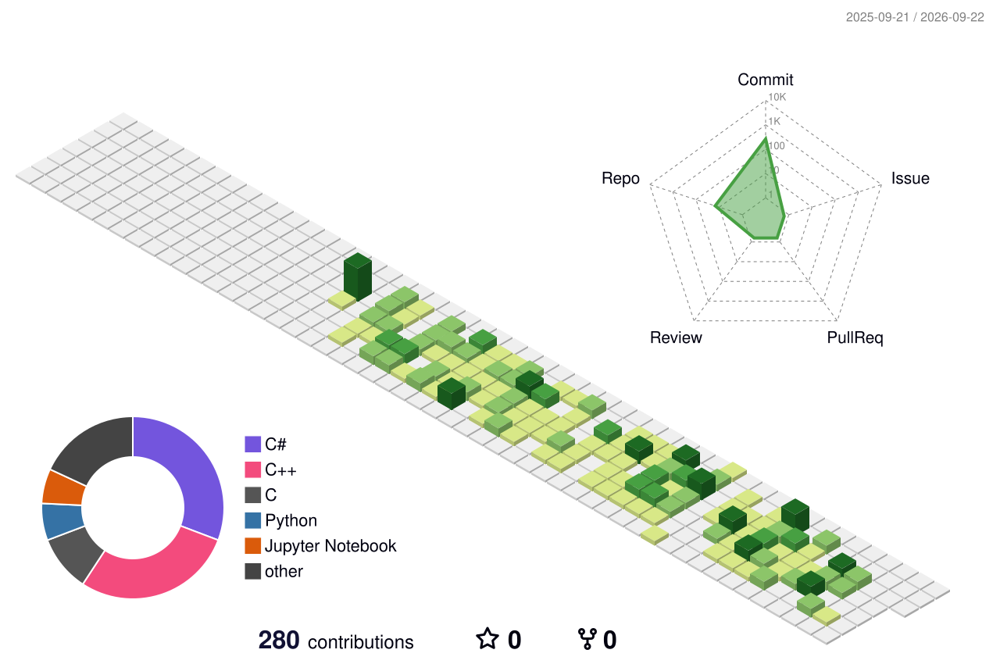

  

 

## PROFILE

| | |
|:---|:---|
| **이름** | 류재욱 · Ryu Jaewook |
| **직무** | C#/.NET Application Developer |
| **이메일** | [jhryu7658@gmail.com](mailto:jhryu7658@gmail.com) |
| **교육** | 윈도우 플랫폼 기반 IoT 시스템 개발 과정 · 1,200시간 |

 

## TECH STACK

### Languages

  
  
  
  
  

### Application · API

  
  
  
  
  

### IoT · Communication

  
  
  
  
  

### Data · AI

  
  
  
  

### Environment · Tools

  
  
  
  
  
  
  

 

## FEATURED PROJECTS

| Project | What I Built | Problem Solving | Tech |
|:---|:---|:---|:---|
| [**CCTV Monitoring**](https://github.com/jwryu765/iot-dotnet-2026/blob/main/TOYPROJECT1.md) | 공공데이터 CCTV·지도·교통정보를 통합한 데스크톱 모니터링 시스템 | LibVLCSharp로 HLS 영상을 재생하고 WebView2 지도와 ASP.NET Core API를 연동해 외부 데이터를 가공·표시 | C#, WPF, ASP.NET Core |
| [**Book Rental MVVM**](https://github.com/jwryu765/iot-dotnet-2026/blob/main/TOYPROJECT2.md) | 도서·회원·대여 데이터를 관리하는 WPF CRUD 애플리케이션 | CommunityToolkit.Mvvm 기반으로 View와 로직을 분리하고 양방향 바인딩·Command·입력 검증·MySQL CRUD 구현 | C#, WPF, MVVM, MySQL |
| [**Smart Factory Digital Twin**](https://github.com/jwryu765/iot-dotnet-2026/blob/main/TOYPROJECT5.md) | 컨베이어 센싱 결과를 수집해 디지털 트윈으로 시각화하는 공정관리 시스템 | Arduino와 Raspberry Pi의 시리얼 데이터를 MQTT로 중계하고 Unity 화면에 JSON 상태를 실시간 반영 | C#, Unity, MQTT, Arduino |
| [**Word-Quiz**](https://github.com/jwryu765/iot-mini-project1-2026) | 사용자별 학습 기록과 제한 시간 퀴즈를 제공하는 영단어 학습 프로그램 | 키 입력을 기다리는 동안 타이머가 멈추는 문제를 비블로킹 입력으로 해결하고, 입력 줄만 갱신해 화면 깜빡임 최소화 | C++, MySQL |

  <a href="https://github.com/jwryu765?tab=repositories"><b>View all repositories →</b></a>

 

## 🌱 MY CONTRIBUTION 3D GRAPH

  

 
